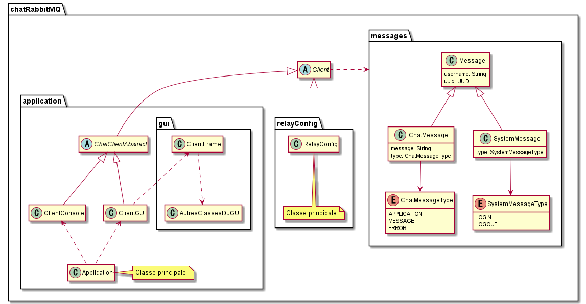

<div align="center">
	<br>
	<br>
	
	<h1>Simple RabbitMQ Chat 🥕</h1>
	<p>
	<p>A simple centralized chat application based on RabbitMQ.</p>
	</p>
	<br>
</div>

## Showcase

<p style="text-align: center">
  
</p>

## Description

Here is an implementation of a relay/client chat model based on RabbitMQ.

## Features

- List of users currently logged in.
- Login/logout system.
- Persistent conversation history.
- User-friendly interface made with Swing 😄.
- UUID system to prevent nickname problems.

## Architecture

<br>

<p style="text-align: center">
  
</p>

> - ### Client
>   - The client represents a user of the chat application, it uses callbacks to receive the different messages, the history of conversations, the list of online users etc....

> - ### Relay
>   - The relay allows to configure the rabbitmq server by creating exchanges and transmitting the conversation history to the online users.

> - ### Messages
>   - Messages represent entities that circulate on the network, messages are serialized and can be categorized into two types: conversations (Chat message) and status messages (System message).

## Instructions

1. Compile the source code with the following command:

   ```console
        mvn clean
        mvn compile
   ```

   > Do not forget to run RabbitMQ server before running the relay and the client:

   ```console
        sudo rabbitmq-server
   ```

2. Use the following command to launch the relay:
   ```console
      mvn exec:java@launch-relay
   ```
3. Use the following command to launch a client:
   ```console
      mvn exec:java@launch-client
   ```

## Potential future improvements

- A private lounge system can be added by implementing a dynamic list of joinable lounges and the possibility to create new ones.
- A better password login system for greater reliability and security.
- A maximum number of users that can connect to the server to regulate the network load.
- A server side (UI) administration panel to manage the network.
